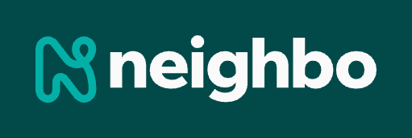

  

<h1 align="center">Hey, we're Neighbo 👋</h1>

  Turning local shops into national gems — one neighborhood at a time.

  📬 <a href="mailto:hello@neighbo.com">Say Hello</a> • 🛍 <a href="https://neighbo.com">Discover Local Shops (coming soon)</a> • 🧰 <a href="https://neighbo.com/merchant">Join Our Merchant Community (coming soon)</a>

---

## 🛒 What’s Neighbo?

Neighbo is your friendly neighborhood commerce platform. Think Shopify, Square, Etsy, DoorDash had a small-town baby. We're here to help **local merchants** shine on a **national stage**, with powerful tools and a sprinkle of that hometown, neighborhood magic ✨

Whether you're browsing from across the street or across the country, Neighbo makes shopping local feel effortless.

## 🔐 Where’s the code?

All the good stuff lives in private repos. We’re still polishing the apples 🍎. But if you landed here looking for collaboration or curiosity...

👉 [neighbo.com](https://neighbo.com) is the place to be.

## 💡 Built for

- **Shoppers** who want to discover hidden gems across the country
- **Merchants and Restuarants** who want storefront superpowers (without tech headaches)
- **Partners & curious minds** who believe small businesses deserve big tools

## 🚀 What's next?

We're rolling out the red carpet for:

...shhh...it's a secret ;)

## 💌 Stay in touch

We're pretty friendly. Reach out any time:

- Website: [neighbo.com](https://neighbo.com)
- Email: [hello@neighbo.com](mailto:hello@neighbo.com)
- Coffee? Maybe later ☕

---

> 🧭 Neighbo: Making Main Street shoppable from anywhere.
